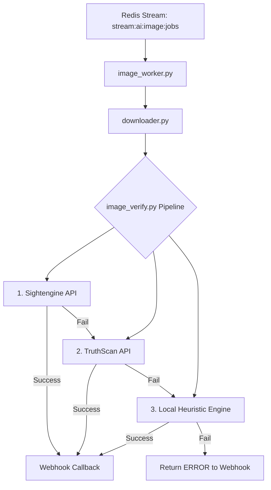

# Image Verification Forensic Engine

---

## 📖 Overview

The **Image Verification Forensic Engine** is a robust, multi-stage pipeline designed to determine the authenticity of an image. It classifies images into three categories:

- **AI** (Generated or significantly manipulated by Artificial Intelligence)
- **NONAI** (Real, unaltered photograph)
- **UNCERTAIN** (Insufficient data to make a confident decision)

This system is built for **production-level high availability** and utilizes a **fallback architecture**. It first attempts to verify images using industry-leading external APIs (Sightengine, TruthScan). If these are unavailable or fail, it seamlessly falls back to a custom **local heuristics engine** that combines cryptography, optical physics, statistical analysis, and AI fingerprint detection.

---

## 🏗️ Architecture & Processing Pipeline

The module operates as an asynchronous Redis worker, pulling jobs from a Redis stream, processing them, and sending the results via webhooks.



### Module Breakdown

1. **Worker Service (`image_worker.py`)**: Subscribes to Redis streams using dual-threads (handling both Render and Upstash Redis clusters for redundancy). It processes abandoned jobs (PEL) upon restart to prevent job loss.
2. **Verification Pipeline (`image_verify.py`)**: The orchestrator that handles the API failovers and routing.
3. **Downloader (`downloader.py`)**: Safely downloads images (max 15MB, enforcing allowed mimetypes) and converts them into the formats required by downstream processors (`PIL.Image`, Grayscale Numpy Array, Raw Bytes).
4. **Sightengine Integration (`sightengine/`)**: Uses multiple rotating API keys and exponential backoff to fetch the AI probability score.
5. **TruthScan Integration (`truthscan/`)**: Generates pre-signed URLs, uploads images to DigitalOcean Spaces, triggers detection, and polls the asynchronous endpoint for results.
6. **Heuristics Engine (`heuristics/`)**: A fallback local forensic suite running 18 distinct analysis modules.

---

## 🧠 Local Heuristics Engine

When the system falls back to the internal heuristics engine, it analyzes the image across several scientific domains using the following modules:

### 1. Cryptography & Provenance
- `metadata.py`: Extracts and validates EXIF data.
- `c2pa.py`: Checks Content Authenticity Initiative (C2PA) manifests.
- `watermark.py`: Detects hidden AI generator watermarks.

### 2. Statistical & Frequency Analysis
- `frequency_domain_analysis.py`: Analyzes FFT/DCT patterns to find synthetic uniformities.
- `benfords_law.py`: Verifies if pixel distributions follow natural mathematical laws.
- `pixel_level_analysis.py`: Looks for unnatural pixel transitions.

### 3. Optical Physics
- `sensor_pattern_noise.py`: Identifies camera hardware fingerprints (PRNU). Real photos have camera sensor noise; AI images do not.
- `chromatic_aberration.py`: Validates physical lens distortions.
- `physics_geometry.py`: Analyzes lighting, shadows, and perspective consistencies.

### 4. Forgery Detection
- `ela_analysis.py`: Error Level Analysis to detect differing JPEG compression levels (often a sign of splicing).
- `copy_move.py`: Detects duplicated/cloned regions.
- `compression_artifact_analysis.py` & `patch_analyzer.py`: Identifies unnatural compression signatures.

### 5. AI Fingerprints
- `gan.py`: Looks for Generative Adversarial Network artifacts.
- `diffusion_latent_analysis.py` & `autoencoder_reconstruction.py`: Tests the image against standard AI diffusion models.
- `perturbation_robustness_testing.py` & `visual_artifacts.py`: Checks how the image degrades, revealing AI generation patterns.

All these signals are passed to the `decision_engine.py`, which aggregates the scores into a final `ai_score` and `real_score` to yield a conclusive decision.

---

## 🛠️ Tech Stack & Dependencies

**Core Engine:** Python 3.x

**Key Libraries:**
- `redis`: Job queues and streams.
- `requests`: API interactions and downloading.
- `numpy`: Matrix and mathematical pixel operations.
- `Pillow` (PIL) & `opencv-python-headless`: Image processing.
- `PyWavelets`: Frequency domain analysis.
- `exifread` & `piexif`: Metadata extraction and validation.
- `dotenv`: Environment variable management.

---

## 🚀 How to Run (Production)

### 1. Environment Setup

Ensure you have your environment variables properly configured. Create a `.env` file in the root directory (or inject these into your production environment):

```env
# Redis Streams
REDIS_RENDER_IMAGE_URL="rediss://..."
REDIS_UPSTASH_IMAGE_URL="rediss://..."
REDIS_RENDER_CHECK_RATE=1000
REDIS_UPSTASH_CHECK_RATE=1000

# API Keys (Comma-separated for rotation)
SIGHTENGINE_API_USERS="user1,user2"
SIGHTENGINE_API_SECRET="secret1,secret2"
TRUTHSCAN_API_KEY="key1,key2"

# Resiliency Configurations
EXPONENTIAL_BACKOFF_MAX_RETRIES=3
EXPONENTIAL_BACKOFF_BASE_TIME=2
```

### 2. Install Dependencies

Install the required Python packages specific to this module:

```bash
pip install -r requirements.txt
```

### 3. Start the Worker

Run the worker process. In a production environment, this should be managed by a process manager like PM2, Systemd, or run as a Docker container.

```bash
python image_worker.py
```

*The worker will automatically create the Redis consumer groups if they don't exist, process any abandoned jobs, and begin listening for new ones.*

---

## 📤 Output Format

When a job completes, the worker sends an HTTP POST request to the `callback_url` provided in the initial job payload. The payload looks like this:

```json
{
  "jobId": "uuid-string",
  "clientId": "uuid-string",
  "image_url": "https://example.com/image.jpg",
  "image_hash": "optional-hash",
  "mark": "AI | NONAI | UNCERTAIN | ERROR",
  "confidence": 98.5,
  "reason": "Sightengine detected a high probability of AI generation. Suspected generator: midjourney.",
  "retry": 0
}
```

---

## ⚠️ Disclaimer & Production Notes

- **Accuracy:** This system relies on heuristics and evolving third-party APIs. Results are not guaranteed to be 100% accurate and should be treated as highly educated probabilities rather than definitive proof.
- **Performance:** If both Sightengine and TruthScan fail, the local heuristics engine is computationally expensive. Ensure the server running this worker has adequate CPU and RAM available for heavy NumPy/PIL operations.

---
> **Status:** Active Development — Results may not always be accurate.