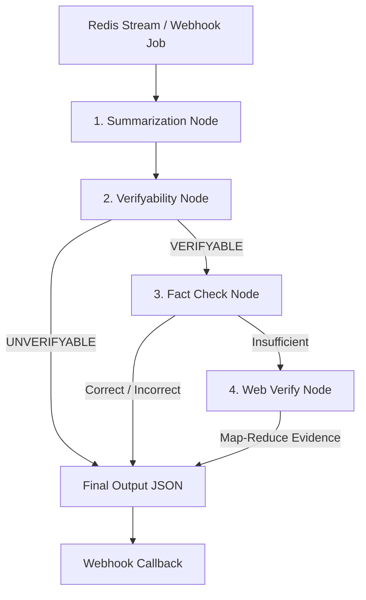

# SatyaMark AI Text Verification Module

## Overview
This system is an **end-to-end, asynchronous text verification pipeline** built with a multi-stage AI agent architecture. It is designed to consume statements, analyze them for verifiability, verify them using LLM internal knowledge, and dynamically fall back to live web search using a sophisticated Map-Reduce fact-checking algorithm. 

The pipeline guarantees high-accuracy, hallucination-free verification while filtering out subjective claims and optimizing for low latency when web search isn't required.

---

## 🏗 Architecture

The core pipeline is orchestrated using **LangGraph** as a state machine. It processes input in four major nodes, controlled by `starter/text_verify.py`:



### 1. Summarization (`summary/`)
- Cleans and normalizes user text, stripping social media artifacts (URLs, engagement metrics, timestamps) using regex (`cleaner.py`).
- Uses an LLM to correct, normalize, and generate a short, extractive summary to prevent hallucination during fact-checking.

### 2. Verifyability Check (`verification/verifyability.py`)
- Analyzes if the claim is **VERIFYABLE** (objective facts, public events) or **UNVERIFYABLE** (personal opinions, future predictions, subjective statements).
- If Unverifiable, the pipeline terminates immediately without triggering search.

### 3. Fact Check (LLM Internal Knowledge) (`verification/factcheck.py`)
- The summarized statement is fact-checked against the LLM's internal weights.
- It applies strict edge-case rules: if the claim involves hyper-specific numbers, recent events, or is ambiguous, it returns **Insufficient**, triggering live web search.

### 4. Web Search Verification (Live Web Evidence) (`websearch/`)
- **Query Building**: Translates the claim into powerful Google search queries.
- **Search**: Fetches URLs using **Google Serper API**, automatically excluding social media and video domains.
- **Scraping**: Downloads article content concurrently using **trafilatura**.
- **Map-Reduce Fact-Checking**: 
  - *Map Phase*: Chunks text and extracts sentences specifically relevant to the statement.
  - *Reduce Phase*: An LLM compares the condensed evidence against the statement and produces a final verdict (Correct, Incorrect, Insufficient) with grounded citations.

---

## 🛠 Tech Stack
- **Python 3**
- **LLM Orchestration**: LangGraph, LangChain (Anthropic & HuggingFace integrations)
- **Primary LLMs**: Anthropic (Claude 3.5 Haiku/Sonnet), HuggingFace (DeepSeek, Qwen, LLaMA3)
- **Web Scraping**: Trafilatura (pure Python, fast HTML extraction)
- **Search Engine**: Google Serper API
- **Message Broker / Queue**: Redis Streams (Upstash / Render)

---

## 🚀 Setup & Installation

### 1. Requirements
Install all necessary Python dependencies:
```bash
pip install -r requirements.txt
```

### 2. Environment Variables (`.env`)
You must configure a `.env` file in the root of the `AI` directory with the following keys:

```ini
# LLM Providers
ANTHROPIC_API_KEY=your_claude_key
HUGGINGFACE_API_KEY=your_huggingface_key

# Search API (Can accept multiple comma-separated keys for automatic rotation)
SERPER_API_KEYS=key

# Redis Queues (For asynchronous worker processing)
REDIS_RENDER_TEXT_URL=redis://your-render-redis-url:6379
REDIS_UPSTASH_TEXT_URL=rediss://your-upstash-redis-url:6379
REDIS_RENDER_CHECK_RATE=1000
REDIS_UPSTASH_CHECK_RATE=1000

# Webhook Self URL (Optional based on environment)
SELF_URL=https://your-production-url.com
```

---

## ⚙️ Running the Module

The module runs as an asynchronous worker daemon that continuously polls the Redis streams (`stream:ai:text:jobs`) for new text verification jobs.

To start the worker:
```bash
python starter/text_worker.py
```

### How the Worker Handles Jobs:
1. Connects to the configured Redis streams via persistent threads.
2. Reads jobs containing `jobId`, `text`, and a `callback_url`.
3. Processes the text through the LangGraph pipeline (`verify_text`).
4. POSTs the final result (mark, reason, confidence, urls) back to the provided `callback_url`.
5. Automatically handles network drops, retries, and abandoned jobs (PEL processing).

---

## 🧠 LLM Routing & Fallbacks
The system employs a smart routing mechanism (`utils/llm.py`). It prioritizes models in a predefined order (e.g., Claude first, then HuggingFace). If a model fails, times out, or hits a rate limit, the router automatically fails over to the next available provider/model, ensuring high reliability in production.

---

> **Status:** Active Development — Results may not always be accurate.
