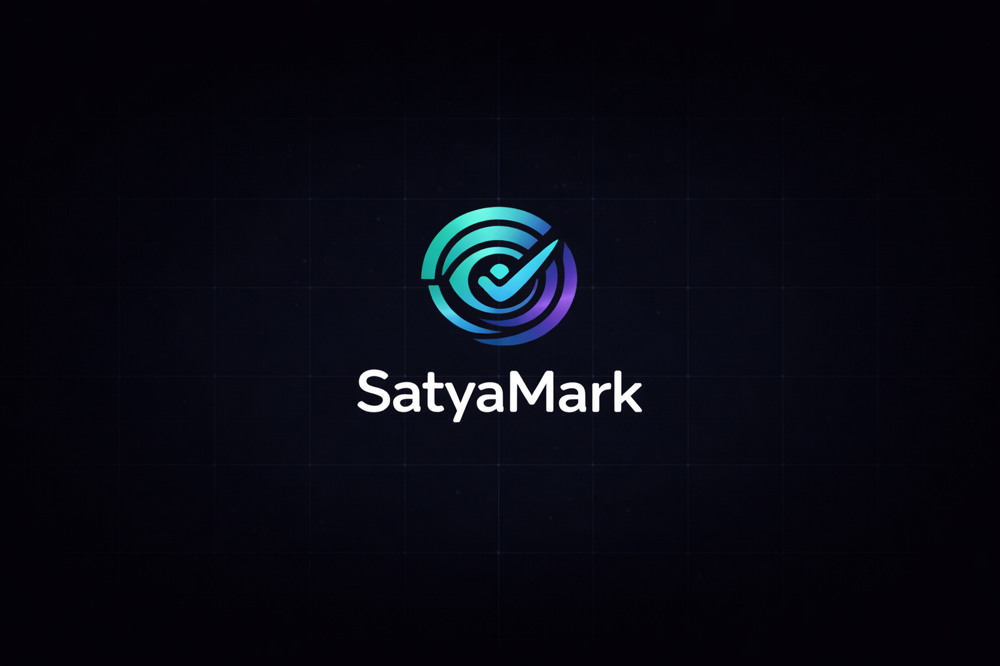
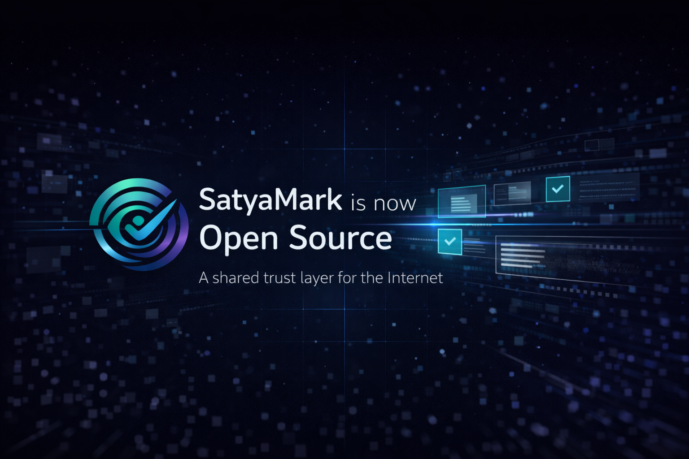

<!-- Logo / Banner -->
<p align="center">
  
</p>

# SatyaMark

SatyaMark is an open-source, AI-powered **content verification infrastructure** that helps platforms and users assess the credibility of digital content in real time.

Instead of claiming absolute truth, SatyaMark surfaces **transparent trust signals** — verification marks, confidence levels, and explanations — enabling informed judgment.

---

## Live

> Live instances.

1. **SatyaMark App (Main Verification UI)**  
   <a href="https://satyamark.vercel.app/" target="_blank" rel="noopener noreferrer">
     https://satyamark.vercel.app/
   </a>

2. **Demo Social Media / Media Verification**  
   <a href="https://satyamark-demo-socialmedia.vercel.app/" target="_blank" rel="noopener noreferrer">
     https://satyamark-demo-socialmedia.vercel.app/
   </a>

3. **React Library (SDK)**  
   <a href="https://www.npmjs.com/package/satyamark-react" target="_blank" rel="noopener noreferrer">
     https://www.npmjs.com/package/satyamark-react
   </a>

---

## The Problem

Misinformation spreads faster than verified facts across social platforms, messaging apps, and digital media.

Current approaches suffer from:
- Fragmented, platform-specific solutions
- Binary verdicts with false certainty
- Poor handling of AI-generated or manipulated media
- Lack of transparency and confidence
- No shared or recognizable trust signal across platforms

There is **no unified, real-time verification layer or universal trust mark for the internet**.

---

## The Solution

SatyaMark acts as a **neutral verification layer** that can be embedded into any platform.

It provides a **universal mark of truth** that appears consistently across platforms, allowing users to recognize and interpret verification signals regardless of where the content is seen.

SatyaMark:
- Verifies content incrementally using multiple signals
- Surfaces a standardized, cross-platform trust mark
- Clearly communicates confidence and uncertainty
- Provides explainable, human-readable results
- Improves accuracy over time through feedback

SatyaMark is **trust infrastructure**, not a final authority.

---

## High-Level Architecture

```
Client Platforms
        │
        ▼
SDK / API Layer
        │
        ▼
Backend (Orchestration & Storage)
        │
        ▼
AI Workers (Text / Image)
        │
        ▼
Verdicts + Confidence + Explanation
```

<p align="center">
  
</p>

---

## Project Components

SatyaMark is split into focused components.  
Each component is independently maintained and documented in detail.

### 🧠 AI — Verification Engine
Handles all AI-driven verification logic such as text fact-checking and image forensic analysis.

- Repo:  
  <a href="https://github.com/DhirajKarangale/SatyaMark/tree/main/AI" target="_blank" rel="noopener noreferrer">
    https://github.com/DhirajKarangale/SatyaMark/tree/main/AI
  </a>

- Docs:  
  <a href="https://github.com/DhirajKarangale/SatyaMark/blob/main/AI/README.md" target="_blank" rel="noopener noreferrer">
    https://github.com/DhirajKarangale/SatyaMark/blob/main/AI/README.md
  </a>

---

### ⚙️ Backend — API & Orchestration
Coordinates verification jobs, communicates with AI workers, and aggregates results.

- Repo:  
  <a href="https://github.com/DhirajKarangale/SatyaMark/tree/main/Backend" target="_blank" rel="noopener noreferrer">
    https://github.com/DhirajKarangale/SatyaMark/tree/main/Backend
  </a>

- Docs:  
  <a href="https://github.com/DhirajKarangale/SatyaMark/blob/main/Backend/README.md" target="_blank" rel="noopener noreferrer">
    https://github.com/DhirajKarangale/SatyaMark/blob/main/Backend/README.md
  </a>

---

### 🎨 Frontend — UI, Demos & SDK
Provides user-facing interfaces, demos, and a reusable React SDK.

- **SatyaMark Web App**  
  Repo:  
  <a href="https://github.com/DhirajKarangale/SatyaMark/tree/main/Frontend/Satyamark" target="_blank" rel="noopener noreferrer">
    https://github.com/DhirajKarangale/SatyaMark/tree/main/Frontend/Satyamark
  </a>  
  Docs:  
  <a href="https://github.com/DhirajKarangale/SatyaMark/blob/main/Frontend/Satyamark/README.md" target="_blank" rel="noopener noreferrer">
    https://github.com/DhirajKarangale/SatyaMark/blob/main/Frontend/Satyamark/README.md
  </a>

- **Demo Social Media / Media Verification**  
  Repo:  
  <a href="https://github.com/DhirajKarangale/SatyaMark/tree/main/Frontend/DemoMedia" target="_blank" rel="noopener noreferrer">
    https://github.com/DhirajKarangale/SatyaMark/tree/main/Frontend/DemoMedia
  </a>  
  Docs:  
  <a href="https://github.com/DhirajKarangale/SatyaMark/blob/main/Frontend/DemoMedia/README.md" target="_blank" rel="noopener noreferrer">
    https://github.com/DhirajKarangale/SatyaMark/blob/main/Frontend/DemoMedia/README.md
  </a>

- **React SDK (`satyamark-react`)**  
  Repo:  
  <a href="https://github.com/DhirajKarangale/SatyaMark/tree/main/Frontend/satyamark-react" target="_blank" rel="noopener noreferrer">
    https://github.com/DhirajKarangale/SatyaMark/tree/main/Frontend/satyamark-react
  </a>  
  Docs:  
  <a href="https://github.com/DhirajKarangale/SatyaMark/blob/main/Frontend/satyamark-react/README.md" target="_blank" rel="noopener noreferrer">
    https://github.com/DhirajKarangale/SatyaMark/blob/main/Frontend/satyamark-react/README.md
  </a>  
  npm:  
  <a href="https://www.npmjs.com/package/satyamark-react" target="_blank" rel="noopener noreferrer">
    https://www.npmjs.com/package/satyamark-react
  </a>

---

## Local Setup

Clone the repository:

```bash
git clone https://github.com/DhirajKarangale/SatyaMark.git
cd SatyaMark
```

Follow the setup instructions for each component you want to run:

- **AI setup**  
  <a href="https://github.com/DhirajKarangale/SatyaMark/blob/main/AI/README.md" target="_blank" rel="noopener noreferrer">
    https://github.com/DhirajKarangale/SatyaMark/blob/main/AI/README.md
  </a>

- **Backend setup**  
  <a href="https://github.com/DhirajKarangale/SatyaMark/blob/main/Backend/README.md" target="_blank" rel="noopener noreferrer">
    https://github.com/DhirajKarangale/SatyaMark/blob/main/Backend/README.md
  </a>

- **Frontend – Demo Social Media**  
  <a href="https://github.com/DhirajKarangale/SatyaMark/blob/main/Frontend/DemoMedia/README.md" target="_blank" rel="noopener noreferrer">
    https://github.com/DhirajKarangale/SatyaMark/blob/main/Frontend/DemoMedia/README.md
  </a>

- **Frontend – SatyaMark Website**  
  <a href="https://github.com/DhirajKarangale/SatyaMark/blob/main/Frontend/Satyamark/README.md" target="_blank" rel="noopener noreferrer">
    https://github.com/DhirajKarangale/SatyaMark/blob/main/Frontend/Satyamark/README.md
  </a>

- **React Library (`satyamark-react`)**  
  <a href="https://github.com/DhirajKarangale/SatyaMark/tree/main/Frontend/satyamark-react" target="_blank" rel="noopener noreferrer">
    https://github.com/DhirajKarangale/SatyaMark/tree/main/Frontend/satyamark-react
  </a>

---

## Open Source Principles

- Transparency over certainty
- Privacy-first by default
- Honest capability disclosure
- Incremental improvement
- No overpromising

---

## Limitations & Scope

- Video and audio verification are not yet supported
- Image verification is experimental
- Results should not be treated as absolute truth
- Some components are research-grade

---

<p align="center">
  
</p>

---

## Summary

**SatyaMark is an open trust infrastructure layer that verifies digital content and surfaces clear, evidence-backed credibility signals in real time.**
