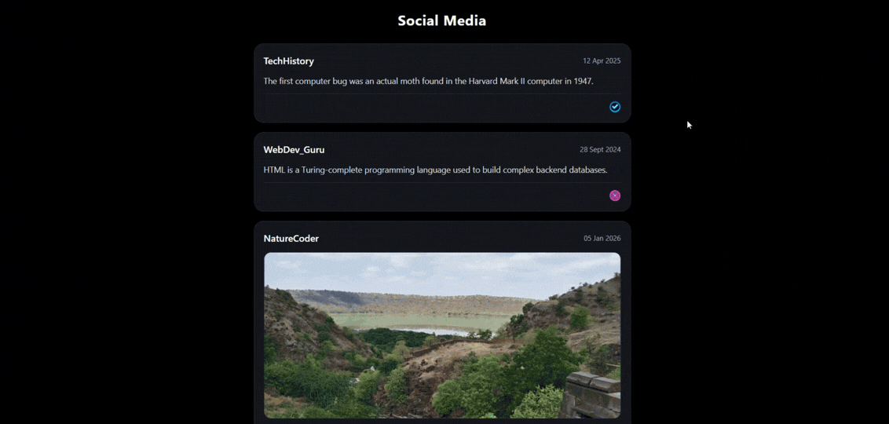
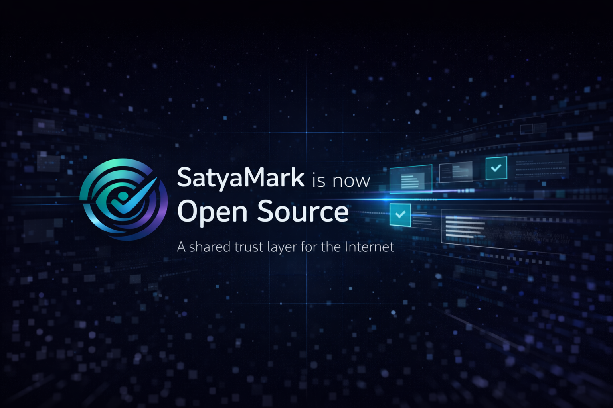
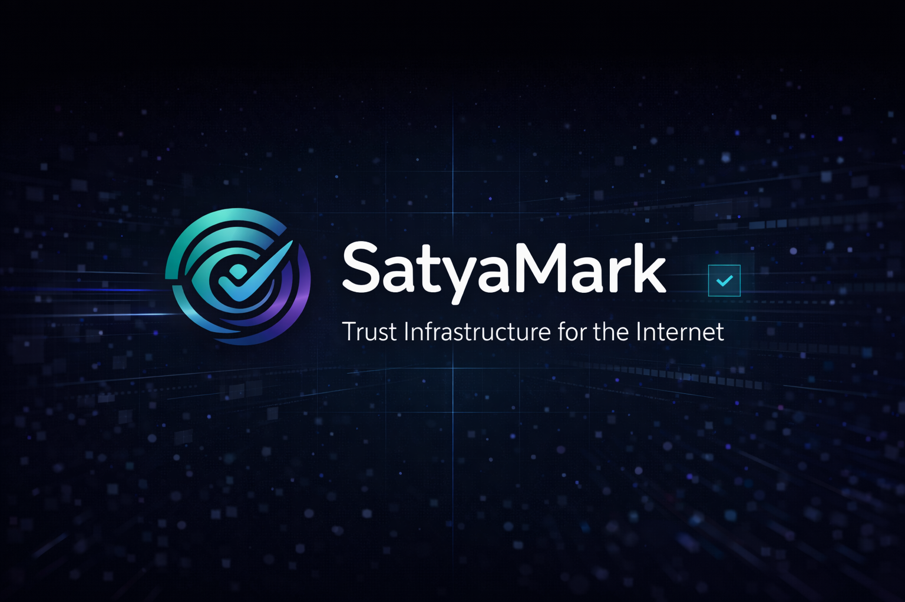

<h1 align="center">SatyaMark</h1>

<p align="center">
  Open‑source <strong>multi‑modal content verification infrastructure</strong> with an official React SDK for platform integration.
</p>

<p align="center">
  <a href="https://www.npmjs.com/package/satyamark-react">
    
  </a>
  <a href="https://opensource.org/licenses/MIT">
    
  </a>
  <a href="https://www.npmjs.com/package/satyamark-react">
    
  </a>
</p>

<p align="center">
  
</p>

---

## ⚠️ Project Status

> **This project is active and evolving.**

Text verification is stable.  
Image ML + forensics are experimental and improving.  
SDK and backend APIs may be enhanced iteratively.

Community feedback and contributions are welcome.

---

## ✨ What Is SatyaMark?

SatyaMark is an open-source, multi-modal content verification platform. It solves the computational expense of real-time fact-checking by decoupling frontend DOM extraction (via a React SDK) from backend AI processing (via Node.js and Python workers).

**Core Features:**

- **Non-Binary Verdicts:** Outputs confidence scores and explainable reasoning instead of absolute "True/False" labels.
- **Asynchronous Processing:** Uses Redis Streams (xAdd, xReadGroup) to queue expensive tasks without blocking the UI.
- **Multi-Modal AI Pipeline:** Evaluates text via LangGraph state-machines and tests images against 22+ local forensic heuristics.

The ecosystem also includes:

- 🧠 **AI verification workers** — Text fact‑checking, AI‑image detection, forensics  
- ⚙️ **Backend orchestrator** — Redis Streams + WebSockets + PostgreSQL  
- 🎨 **Frontend web app** — Result viewer & manual verification  
- 📦 **Published React SDK** — `satyamark-react` for platform embedding

It acts as a **neutral verification layer** — surfacing trust signals, not absolute truth.

---

## 🚀 Quick Links & Live Projects

| Resource | Link |
|----------|------|
| 🌐 Official Website / Web App | [SatyaMark](https://satyamark.js.org/) |
| 📱 Demo Social Media App | https://satyamark-demo-socialmedia.vercel.app/ |
| 📦 React SDK (npm) | https://www.npmjs.com/package/satyamark-react |
| 👨‍💻 Creator's Portfolio | https://dhirajkarangale.vercel.app/ |

---

## 🧠 The Problem

Modern platforms struggle with:

- fragmented verification systems  
- binary & opaque verdicts  
- AI‑generated and manipulated media  
- lack of transparency  
- no universal trust mark  

There is **no shared, real‑time verification infrastructure for the internet.**

---

## 🟢 The SatyaMark Solution

SatyaMark introduces a **universal trust signal** powered by:

- incremental verification
- confidence scoring
- explainable reasoning
- cross‑platform consistent marks
- integration via SDK

It is **trust infrastructure**, not a fact‑checking authority.

---

## 🎯 Why Use It & Who Is It For?

**Why Use It?**
Comprehensive verification is computationally expensive (involving claim extraction, evidence search, LLM querying, and forensic checks). Doing this synchronously is slow and degrades user experience. SatyaMark solves this by decoupling heavy verification workloads from user-facing interactions using asynchronous processing and real-time communication, making complex verification feel fast.

**Who Is It For?**
- **Platforms & Forums:** Social networks, online forums, messaging apps, CMS providers, and news aggregators looking to combat misinformation natively.
- **Users:** Platform moderators, researchers, journalists, and the general public who need transparent, evidence-backed verdicts.

---

## 🏗 High‑Level Architecture

```
Client Platforms (via satyamark-react)
        │
        ▼
Backend (Orchestration + Storage + Streams)
        │
        ▼
AI Workers (Text / ML / Forensics)
        │
        ▼
Verdicts + Confidence + Explanation
```

<p align="center">
  
</p>

---

## 🛠 Technology Stack

- **Client Ecosystem (React, Vite, NPM):** The `satyamark-react` SDK is built natively for React to easily latch onto React refs.
- **Orchestration Server (Node.js, Express, `ws`):** Acts as "airport traffic control", managing thousands of persistent WebSocket connections concurrently without blocking.
- **Distributed Queues (Redis Streams):** Provides event persistence, consumer groups, reliable delivery, and decoupled horizontal scaling.
- **Relational Persistence & Caching (PostgreSQL):** Persists verified objects and acts as a massive deduplication caching layer.
- **AI Pipelines (Python, LangGraph, LangChain):** Uses LangGraph to model the text verification pipeline as a strict, observable state-machine.
- **Vector Retrieval & LLMs:** Uses FAISS/Milvus for semantic searches, supported by Anthropic Claude, Hugging Face, and Google Search.

---

## 🔄 End-to-End Data Flow

1. **DOM Extraction & Handshake:** The SDK extracts visible claims and establishes a WebSocket connection.
2. **Caching & Deduplication:** The backend computes a SHA-256 hash of the content. On a PostgreSQL cache hit, the result is broadcasted instantly.
3. **Memory-Aware Routing:** The system checks Redis RAM saturation. If safe, it queues the job; otherwise, it dynamically load-balances to a secondary cluster.
4. **Autonomous Intelligence Layer:** Independent Python workers consume jobs via Redis Streams (`xReadGroup`). Text is verified via LangGraph pipelines; images undergo comprehensive forensic analysis (22+ heuristics).
5. **Returning Results:** Workers post the verdict back via HTTP. The backend persists it to the database and pushes the result to the specific client via WebSockets.

---

## 🛡️ Self-Healing & Scalability

SatyaMark ensures expensive jobs are never lost in the ether:
- **Job Janitor:** A daemon sweeps for "stuck" jobs (e.g., claimed by a crashed worker) and reassigns them using a 3-strike retry system. Fatal jobs are routed to a Dead Letter Queue (DLQ).
- **Job Transfer:** Actively scoops unassigned jobs from saturated Redis clusters and transfers them to free clusters to prevent deadlocks.
- **Independent Scaling:** Because Python workers are decoupled from the Node.js orchestrator via Redis, each component (e.g., text workers vs. image workers) scales horizontally on its own.

---

## 🧩 Repository Structure

```
SatyaMark/
├── AI/                     # Verification workers
├── Backend/                # Redis + WS + DB orchestrator
├── Frontend/
│   ├── Satyamark/          # Main web app
│   ├── DemoMedia/          # Social media demo
│   └── satyamark-react/    # React SDK (npm)
├── Assets/
├── LICENSE
├── CONTRIBUTING.md
├── SECURITY.md
└── README.md
```

👉 This is a framework — not a single application.

---

## 📦 React SDK (satyamark-react)

Install:

```bash
npm install satyamark-react
```

Minimal usage:

```tsx
process(ref.current, post.id);
registerStatus(jobId, ref.current);
```

The SDK enables any React platform to embed SatyaMark trust marks in real time.

---

## 🧪 Run Locally

```bash
git clone https://github.com/DhirajKarangale/SatyaMark.git
cd SatyaMark
```

Run components:

- AI → `cd AI && python verify.py`
- Backend → `cd Backend && npm install && npm start`
- Frontend → `cd Frontend/Satyamark && npm install && npm run dev`

See sub‑README for environment variables.

---

## 🧭 Open Source Principles

- Transparency over certainty  
- Privacy‑first  
- Evidence > opinion  
- Honest limitations  
- Incremental improvement  
- Built for extensibility  

---

## Limitations & Scope

- Image verification experimental  
- No video / audio yet  
- Confidence ≠ absolute truth  
- Some components research‑grade  

---

<p align="center">
  
</p>

---

## 🤝 Contributing & Collaboration

You can help by:

- adding new detectors / models  
- improving orchestration  
- enhancing SDK & UI  
- testing edge cases  
- improving documentation  

No contribution is too small.

PRs and issues welcome.

---

<p align="center">
  <strong>Building trust infrastructure — openly, transparently, and with community.</strong>
</p>


Test Search: "satyamark.vercel.app" -site:satyamark.vercel.app